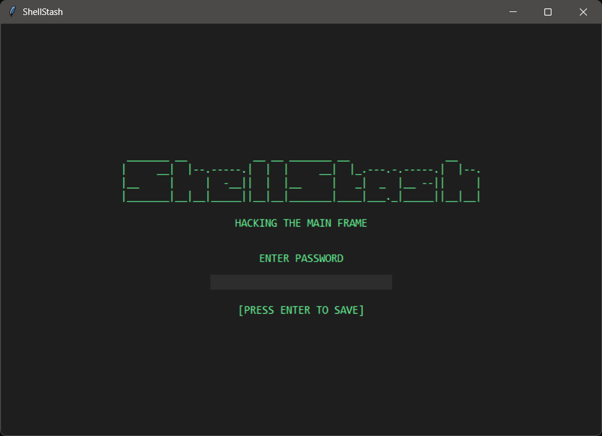
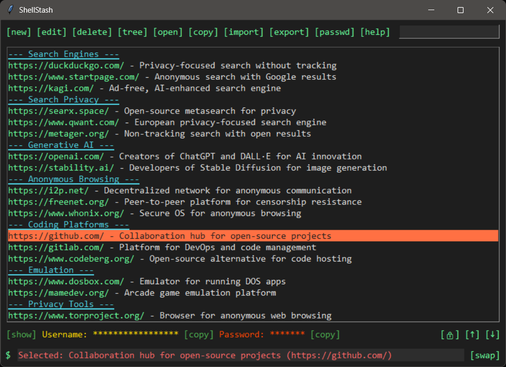
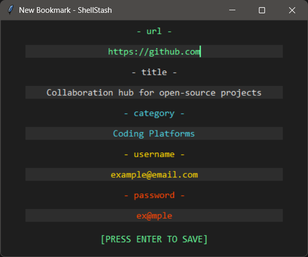
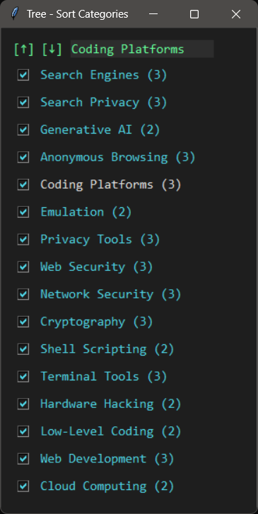

# ShellStash
### Version: 1.0 - First Blood

**ShellStash** is a hacker-themed, terminal-style bookmark manager built in Python. It allows you to securely store, organize, and manage bookmarks with URLs, titles, categories, usernames, and passwords. Bookmarks are encrypted using Fernet (symmetric encryption), and the app features a command-line interface, drag-and-drop sorting, and category management.

 

## Features

- **Secure Storage**: Bookmarks are encrypted with a user-defined password using `cryptography.Fernet`.
- **Bookmark Management**: Add, edit, delete, and search bookmarks with auto-fetched titles.
- **Categories**: Organize bookmarks into categories, with sorting, renaming, and filtering via a tree view.
- **Credentials**: Store and copy usernames/passwords, with a show/hide toggle.
- **Navigation**: Drag-and-drop bookmarks, move up/down, and lock/unlock category boundaries.
- **Import/Export**: Import from HTML (browser-compatible) and export to HTML/TXT.
- **Customizable UI**: Toggle between "default" (dark green) and "alternative" (black-green) color schemes.
- **Command-Line Interface**: Execute commands (`new`, `edit`, `delete`, etc.) via a prompt.
- **Shortcuts**: Ctrl+N (new), Ctrl+O (open), Ctrl+D (delete), Ctrl+E (edit), Ctrl+T (tree).
- **Help System**: Detailed in-app guide with usage tips and troubleshooting.

## Screenshots

| Main Interface | New Bookmark | Tree Window |
|----------------|--------------|-------------|
|  |  |  |

## Installation

### Prerequisites
- Python 3.6+
- Required packages: `cryptography`, `pyperclip`, `beautifulsoup4`, `requests`

### Steps
1. Clone the repository:
   ```bash
   git clone https://github.com/shellStash/shellstash.git
   cd shellstash

Install dependencies:
bash
pip install cryptography pyperclip beautifulsoup4 requests

Or manually install:
bash
pip install cryptography requests beautifulsoup4 pyperclip

Run the application:
bash
python shellstash.py

### Usage
First Launch:
Set a password to encrypt your bookmarks. Confirm it by entering it twice.

The password will be required on subsequent launches to decrypt the bookmark file.

## Main Interface:
Command Buttons: Use [new], [edit], [delete], etc., for bookmark operations.

Search Bar: Type to filter bookmarks by title or URL.

Text Area: View bookmarks grouped by category. Click to select, drag to reorder.

Credential Display: View usernames/passwords (starred by default). Use [show] to reveal or [copy] to copy to clipboard.

Prompt: Enter commands (e.g., new, tree, help) at the $ prompt.

Navigation: Use [↑]/[↓] to move bookmarks, [🔒]/[🔓] to toggle category lock, [swap] to change color schemes.

## Key Commands:
new: Create a new bookmark (Ctrl+N).

edit: Edit the selected bookmark (Ctrl+E).

delete: Delete the selected bookmark (Ctrl+D).

tree: Open the category tree window (Ctrl+T).

open: Open the selected bookmark in a browser (Ctrl+O).

copy: Copy the selected bookmark’s URL.

import/export: Import from HTML or export to HTML/TXT.

passwd: Change the encryption password.

help: View detailed documentation.

swap: Toggle color schemes.

exit: Save and close the app.

## Category Management:
Open the tree window ([tree] or Ctrl+T) to sort, rename, or filter categories.

Toggle category visibility with checkbuttons.

Use [🔒] to restrict bookmark movement within categories or [🔓] to allow cross-category moves.

## Example:
Add a bookmark: Click [new], enter https://example.com, leave title blank (fetches "Example Domain"), set category to "Test", add username/password.

Reorder: Drag the bookmark or use [↑]/[↓].

Search: Type "example" to filter.

Export: Click [export] to save as HTML and TXT.


## Configuration
### Files:
bookmarks.json.enc: Encrypted bookmark data.

salt.bin: Random salt for encryption.

shellstash_config.json: Stores window size and position.

### Customization:
Edit color_schemes in shellstash.py to modify or add color schemes.

Adjust window geometry in shellstash_config.json for default size/position.


## Security Notes
Bookmarks are stored in bookmarks.json.enc, encrypted with your password.

The salt.bin file is required for decryption.

TXT exports contain unencrypted passwords; handle with care.

No password recovery is available due to encryption design.


## Contributing
Contributions are welcome! To contribute:
Fork the Repository:
bash
git clone https://github.com/shellstash/shellstash.git

Create a Branch:
bash
git checkout -b feature/your-feature

Make Changes:
Follow PEP 8 for code style.

Add tests if possible (future test suite planned).

Update documentation for new features.

Submit a Pull Request:
Push your branch and create a PR with a clear description of changes.

Example PR title: Add bookmark tagging feature.

### Ideas for Contributions:
Add support for bookmark tags.

Implement a backup system for bookmark files.

Enhance search with regex or field-specific filters.

Optimize performance for large bookmark lists.

Add macOS/Linux-specific UI tweaks.


## License
This project is licensed under the MIT License. See the LICENSE file for details.


## Support
If you find ShellStash useful, consider supporting its development:
BTC Address: bc1qs8g0eju0gkwtzjhh43sxdwm8yf4anmk29spq2l
Copy the address in the app’s help window ([help]) or donate directly.


## Troubleshooting
Wrong Password: Double-check your password. If lost, delete bookmarks.json.enc and salt.bin to start fresh (loses data).

Import Issues: Ensure HTML files follow the Netscape bookmark format.

Category Movement: If bookmarks won’t move between categories, toggle to [].

Errors: Check the prompt for error messages or consult the [help] guide.

## Happy hacking! 

